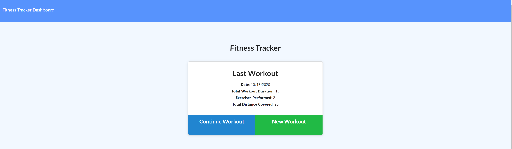
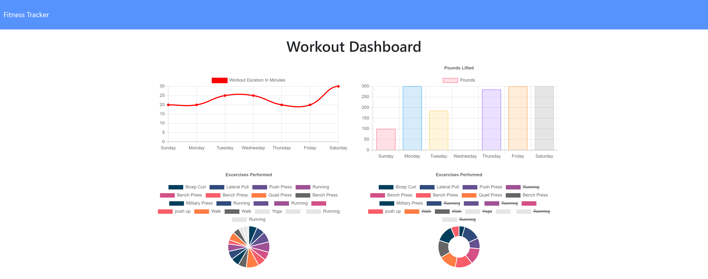

# Fittness-tracker

As a user, I want to be able to view create and track daily workouts. I want to be able to log multiple exercises in a workout on a given day. I should also be able to track the name, type, weight, sets, reps, and duration of exercise. If the exercise is a cardio exercise, I should be able to track my distance traveled.

**Author:** Melinda Ivanov

## Links
- https://github.com/jnsmelinda/Fittness-tracker
- https://damp-citadel-96086.herokuapp.com

## Technologies
- [JavaScript](https://www.javascript.com)
- [Node.js](https://nodejs.org/en/)
- [HTML5](https://en.wikipedia.org/wiki/HTML5)
- [CSS3](https://en.wikipedia.org/wiki/Cascading_Style_Sheets)
- [Git](https://git-scm.com/), [GitHub](https://github.com)
- [MongoDB](https://www.mongodb.com/)
- [Heroku](https://www.heroku.com/)

## Installation
At first, you need to have [node.js](https://nodejs.org/) installed, then you need to install the required modules by running `npm install` in the command-line. If you haven't yet, you need to install MongoDB and start the application on your local machine.

## Demo

## Usage
Visit the heroku link and dd exercises to a previous workout plan or add new exercises to a new workout plan. View the combined weight of multiple exercises under the Dashboard.

## License
This repository is protected under the [MIT](https://choosealicense.com/licenses/mit/) license.

## Contribution
Please contribute to this project by opening a Pull Request and following the `eslint` rules and the [Code of Conduct](https://www.contributor-covenant.org/version/2/0/code_of_conduct/).

## Questions
You can contact me about issues and suggestions in [Email](mailto:jns.melinda@gmail.com), you can also find me on [Github](https://github.com/jnsmelinda).

## Others
Original desing is from the [University of Washington coding bootcamp](https://bootcamp.uw.edu).
 
© 2020 Melinda Ivanov
